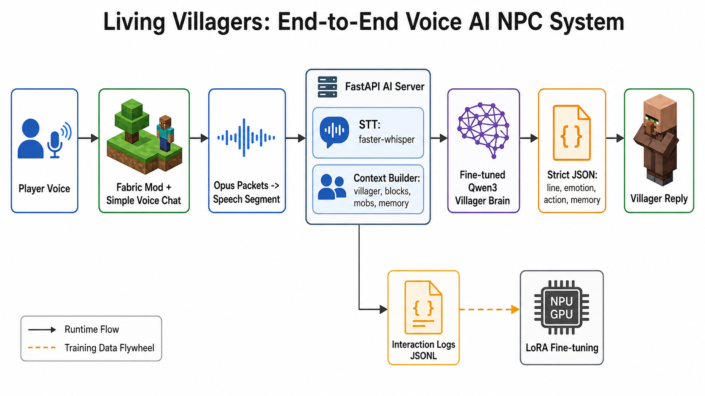
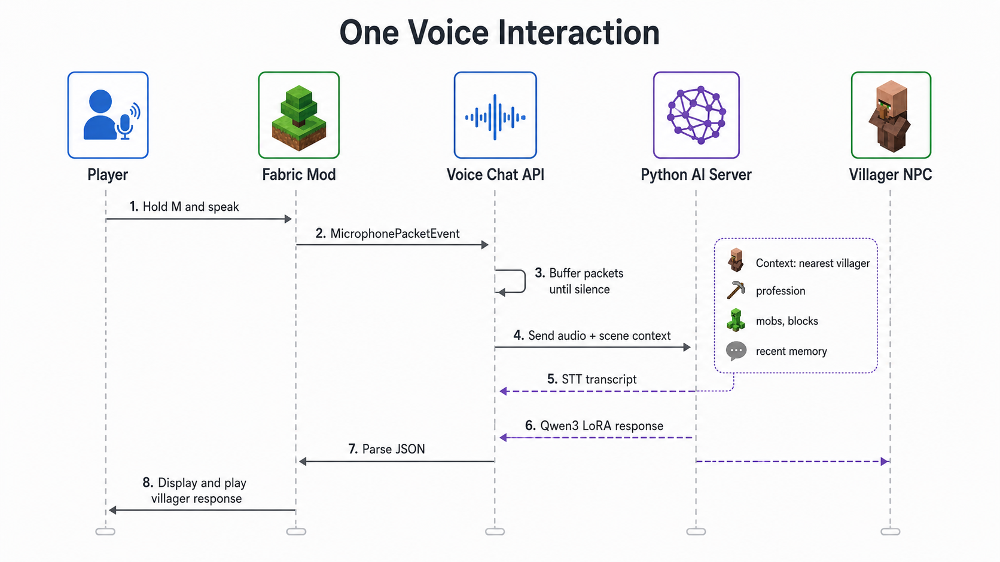
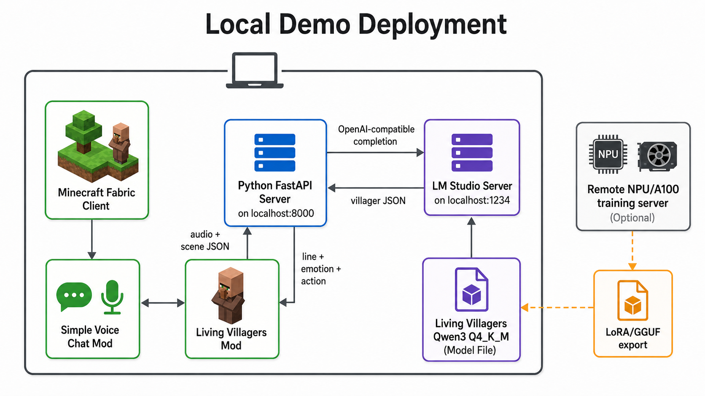
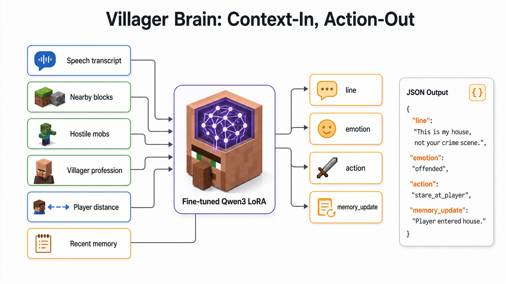
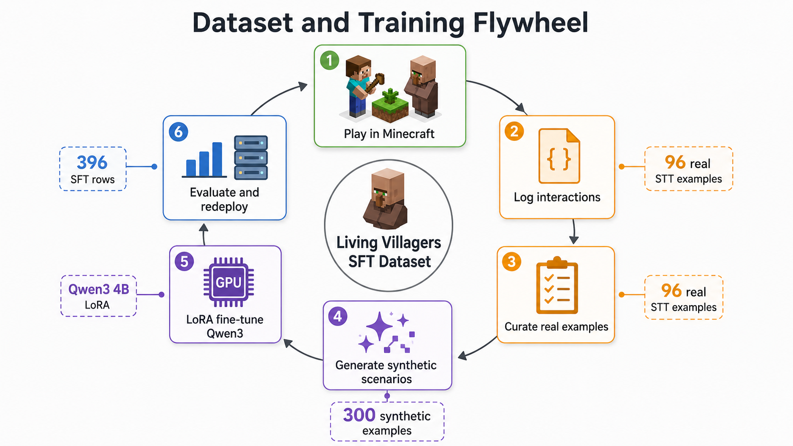
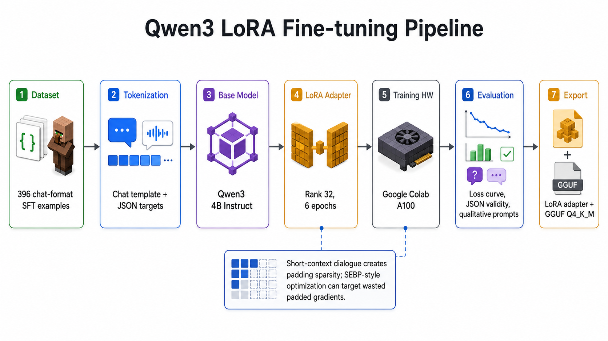
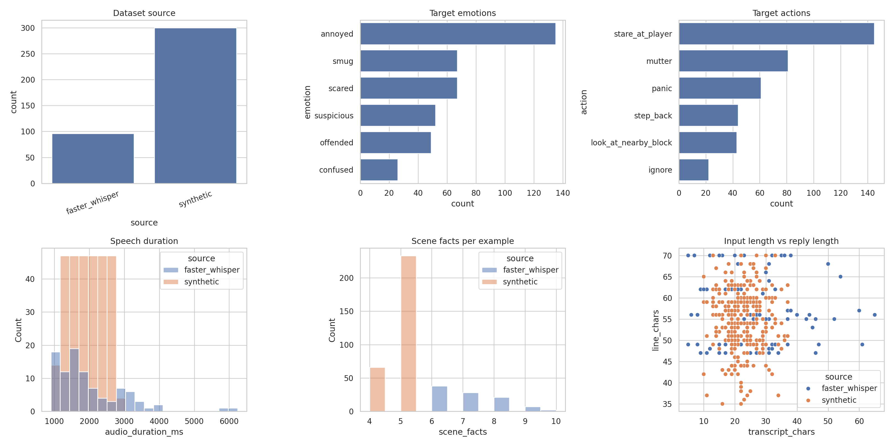
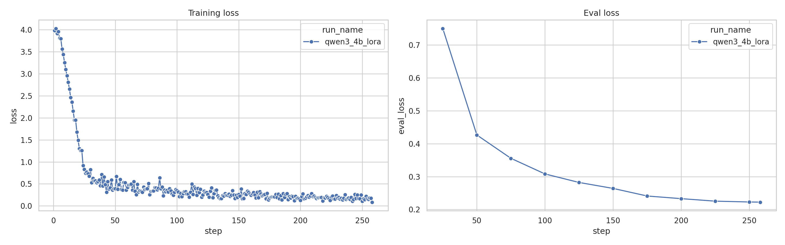
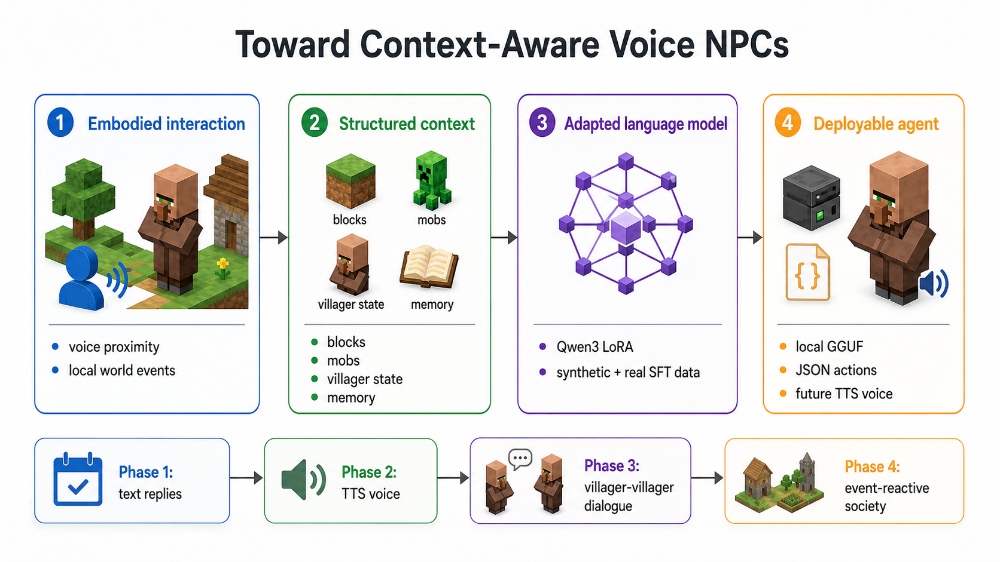
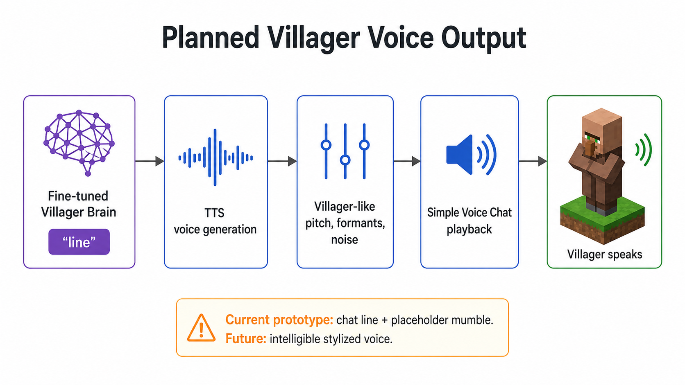

# Onairon's Living Villagers

<p align="center">
  
  
  
  
  
  
  
  
  
</p>

Voice-driven, context-aware Minecraft villagers powered by Simple Voice Chat, a local FastAPI AI server, speech-to-text, and a fine-tuned Qwen villager brain.

The project turns nearby villagers into reactive NPCs: the player talks through the microphone, the mod captures the voice segment, the AI server transcribes it, adds world context and recent memory, and returns a short in-character villager response.

<p align="center">
  
</p>

## What Works

- Fabric Minecraft mod integrated with Simple Voice Chat.
- Voice segment detection from push-to-talk speech.
- FastAPI bridge server for STT, context building, LLM inference, and dataset logging.
- Faster-Whisper speech-to-text for live player speech.
- Local LM Studio inference through an OpenAI-compatible API.
- Fine-tuned Qwen3 4B LoRA exported to GGUF for local testing.
- Villager scene context: nearest villager, profession, dimension, time of day, danger nearby, and recent interaction memory.
- Automatic interaction logging for future dataset growth.

## System Overview

| End-to-End System | One Voice Interaction |
| --- | --- |
|  |  |

| Local Demo Deployment | Villager Brain |
| --- | --- |
|  |  |

The runtime path is:

1. Player speaks in Minecraft through Simple Voice Chat.
2. The Fabric mod buffers the voice packets into a speech segment.
3. The mod sends audio, player identity, villager target, and world facts to the Python server.
4. The server transcribes speech with Faster-Whisper.
5. The server builds a compact prompt with transcript, scene context, and recent memory.
6. The local LLM returns structured JSON: `line`, `emotion`, `action`, and `memory_update`.
7. The mod displays the villager line in chat and can route actions/voice output in future work.

## Villager Brain

The AI server asks for short, reactive, in-world responses rather than generic chatbot text. A response has this shape:

```json
{
  "line": "I have potatoes, you have a speech bubble; pick your winner.",
  "emotion": "annoyed",
  "action": "stare_at_player",
  "memory_update": "Player asked whether the villager has potatoes."
}
```

The villager is prompted to answer the player's speech first, then use scene details only when relevant. For example, distance is included only when the player is actually crowding the villager or talking about moving/space.

## Training Pipeline

The project includes a dataset flywheel: live gameplay produces raw interaction logs, those logs are curated into SFT examples, synthetic examples expand coverage, and LoRA fine-tuning teaches the model the desired villager style.

| Dataset and Training Flywheel | Qwen LoRA Fine-Tuning |
| --- | --- |
|  |  |

The main training experiment fine-tunes `Qwen/Qwen3-4B-Instruct-2507` with LoRA on a mixed dataset of real and synthetic villager interactions.

| Dataset Composition | Training Loss Curves |
| --- | --- |
|  |  |

Current training snapshot:

- Base model: `Qwen/Qwen3-4B-Instruct-2507`
- Method: supervised fine-tuning with LoRA
- Training hardware: Google Colab A100
- Dataset size: 396 SFT examples
- Data mix: real gameplay/STT interactions plus synthetic curated examples
- Final eval loss: about `0.22`
- Local deployment format: GGUF `Q4_K_M`

## Local Demo Setup

### 1. Start LM Studio

Load the fine-tuned Qwen3 GGUF in LM Studio and start the local server on port `1234`.

Check that LM Studio is reachable:

```powershell
curl.exe http://127.0.0.1:1234/v1/models
```

Use the model id shown by LM Studio, for example:

```text
qwen/qwen3-4b-instruct-2507
```

### 2. Start the AI Server

```powershell
# From the repository root
cd ai_server
.\.venv\Scripts\Activate.ps1

$env:LV_STT_BACKEND="faster_whisper"
$env:LV_STT_MODEL_ID="tiny.en"
$env:LV_STT_DEVICE="cpu"
$env:LV_STT_COMPUTE_TYPE="int8"
$env:LV_STT_PRELOAD="true"
$env:LV_STT_TIMEOUT_SECONDS="20"

$env:LV_AI_BACKEND="openai"
$env:LV_OPENAI_BASE_URL="http://127.0.0.1:1234/v1"
$env:LV_OPENAI_API_KEY="not-needed"
$env:LV_OPENAI_API_STYLE="completions"
$env:LV_MODEL_ID="qwen/qwen3-4b-instruct-2507"

$env:LV_MAX_NEW_TOKENS="80"
$env:LV_TEMPERATURE="0.35"
$env:LV_TOP_P="0.85"

python -m uvicorn server:app --host 127.0.0.1 --port 8000
```

Check health:

```powershell
curl.exe http://127.0.0.1:8000/health
```

### 3. Launch Minecraft

```powershell
# From the repository root
.\gradlew runClient
```

In game, hold the Simple Voice Chat push-to-talk key, speak near a villager, release, and wait for the response.

## Dataset Collection

When the AI server is running, every valid interaction can be logged for future training. The default dataset path is reported by `/health`.

Typical loop:

1. Talk to villagers in different situations.
2. Collect raw logs from `ai_server/data`.
3. Curate the logs into SFT examples.
4. Add synthetic edge cases for better coverage.
5. Train LoRA in `notebooks/living_villagers_training_colab.ipynb`.
6. Export adapter/GGUF and test again in LM Studio.

The training notebook contains the end-to-end Colab workflow: loading data, plotting dataset statistics, training LoRA experiments, evaluating qualitative outputs, and exporting artifacts.

## Repository Layout

```text
ai_server/
  server.py                         FastAPI AI bridge
  export_sft_dataset.py             Dataset export helper
  curate_and_synthesize_dataset.js  Curation and synthetic data generation
  data/                             Local generated logs and SFT files

src/main/java/com/onairon/livingvillagers/
  ai/                               Java AI client
  voice/                            Simple Voice Chat plugin integration

notebooks/
  living_villagers_training_colab.ipynb

docs/
  image_generation_prompts.md
  images/                           Architecture and training figures
```

## Current Limitations

- Speech-to-text is still the weakest live component: noisy transcripts produce odd but often funny replies.
- The model can overuse motifs from the dataset, such as potatoes, crafting tables, and personal-space jokes.
- Voice output is currently planned, not fully production-ready. The next clean pipeline is LLM text -> TTS voice -> villager-like audio effects -> Simple Voice Chat playback.
- The system is optimized for a local demo, not a one-click player install yet.

## Roadmap

| Planned Context-Aware Voice NPCs | Planned Villager Voice Output |
| --- | --- |
|  |  |

Next steps:

- Improve STT quality and segment filtering.
- Expand the curated dataset with more direct question-answer examples.
- Add cleaner response scoring and rejection sampling before logging examples.
- Add TTS with a stylized villager-like voice.
- Package the fine-tuned model, dataset, and demo instructions for reproducibility.

## Course Deliverables

This repository is structured for a deep learning project submission:

- Working Minecraft + AI demo code.
- Dataset generation and curation scripts.
- Training notebook with plots and model comparison workflow.
- LoRA fine-tuning artifacts.
- Local GGUF deployment path.
- Figures explaining system architecture, data flow, and training results.

## License

See [LICENSE](LICENSE).
